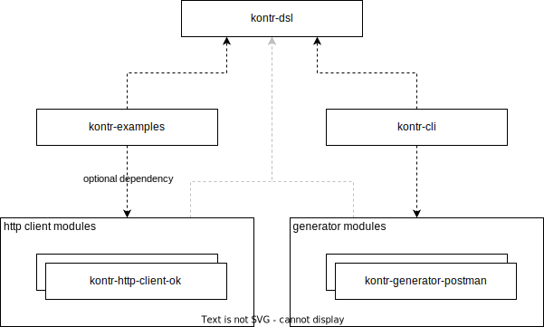

# Kontr
Kontr (/kŏn′too͝r″/) is an opensource project to leverage the power of Kotlin DSL to make a simple and expressive api to create http requests.

## Important warning
Current version is 1.0.0-SNAPSHOT and although is fairly usable please consider it **EXPERIMENTAL** with DSL interfaces SUBJECT TO POSSIBLE CHANGES.

## Requirements
The recommended versions are the latest one available:
- Java 21 or higher
- Kotlin 1.9.22 or higher

No support to other versions is provided although it should be possible to downgrade without much effort.

## DSL examples
This is the simplest usage example:
```kotlin
package org.company.example

import org.kontr.dsl.collection

fun main() {
    collection {
        get("https://raw.githubusercontent.com/domgom/kontr/main/README.md") { onResponse { ok } }
    }
}
```
And we can make more readable functions instead of using the http operations directly.
```kotlin
package org.company.example

import org.assertj.core.api.AssertionsForClassTypes.assertThat
import org.kontr.dsl.CollectionDsl
import org.kontr.dsl.collection

fun main() {
    collection {
        getReadme()
        getLicense("Apache License")
    }
}

private fun CollectionDsl.getReadme() {
    get("https://raw.githubusercontent.com/domgom/kontr/main/README.md") {
        headers {
            Accept("text/html")
        }
        onResponse { healthy }
        onResponse { assertThat(body).startsWith("# Kontr\n") }
    }
}

private fun CollectionDsl.getLicense(licenseName : String) {
    get("https://raw.githubusercontent.com/domgom/kontr/main/LICENSE") {
        headers {
            Accept("text/html")
        }
        onResponse {
            healthy
            assertThat(body.lines().first()).contains()
        }
    }
}
```

## Generation Examples
We can also generate those functions from postman collections so we can focus on building testing workflows instead of crafting the requests individually.
```cmd
// on project root
mvn jar:jar && java -jar kontr-cli/target/kontr-cli-1.0.0-SNAPSHOT-jar-with-dependencies.jar gp "kontr-generator-postman/src/test/resources/auth.postman_collection.json" "kontr-cli/target/generated-sources/postman" "org.example.generated" "Auth"
```
*Future improvements on the tooling/ui side included in the Roadmap

Gives us a good baseline  to work with, although a bit verbose on public modifiers:
```kotlin
package org.example.generated

import kotlin.String
import net.javacrumbs.jsonunit.assertj.assertThatJson
import org.assertj.core.api.Assertions.assertThat
import org.example.generated.Env.baseUrl
import org.example.generated.Env.email
import org.example.generated.Env.password
import org.kontr.dsl.CollectionDsl
import org.kontr.dsl.RequestDsl
import org.kontr.dsl.collection

public data object Env {
    public val baseUrl: String = ""

    public val email: String = ""

    public val password: String = ""
}

public class Auth {
    public class Api {
        public fun CollectionDsl.login(): RequestDsl = post("${baseUrl}/api/login"){
            header("Content-Type", "application/json")
            body = """{"email":"${email}","password":"${password}"}"""
        }

        public fun CollectionDsl.`create user`(): RequestDsl = post("${baseUrl}/api/user"){
            header("Content-Type", "application/json")
            header("Accept", "*/*")
            body = """
        |{
        |  "foos": [
        |    {
        |      "foo": "BAR"  }
        |  ]
        |}
        """.trimMargin()
        }

        public fun runCollection() {
            val c = collection{
                login()
                `create user`()
            }
        }
    }
}
```
## Architecture
Kontr has a modular architecture so new extensions like other http clients or openapi generator can be included in the future.


## Known restrictions
- Only available request/response `body` type is String, no object serde is available.
- Needs to be built locally, no mvn central publishing yet.
- Doesn't work with proxies.

## Future updates
Roadmap: work in progress
