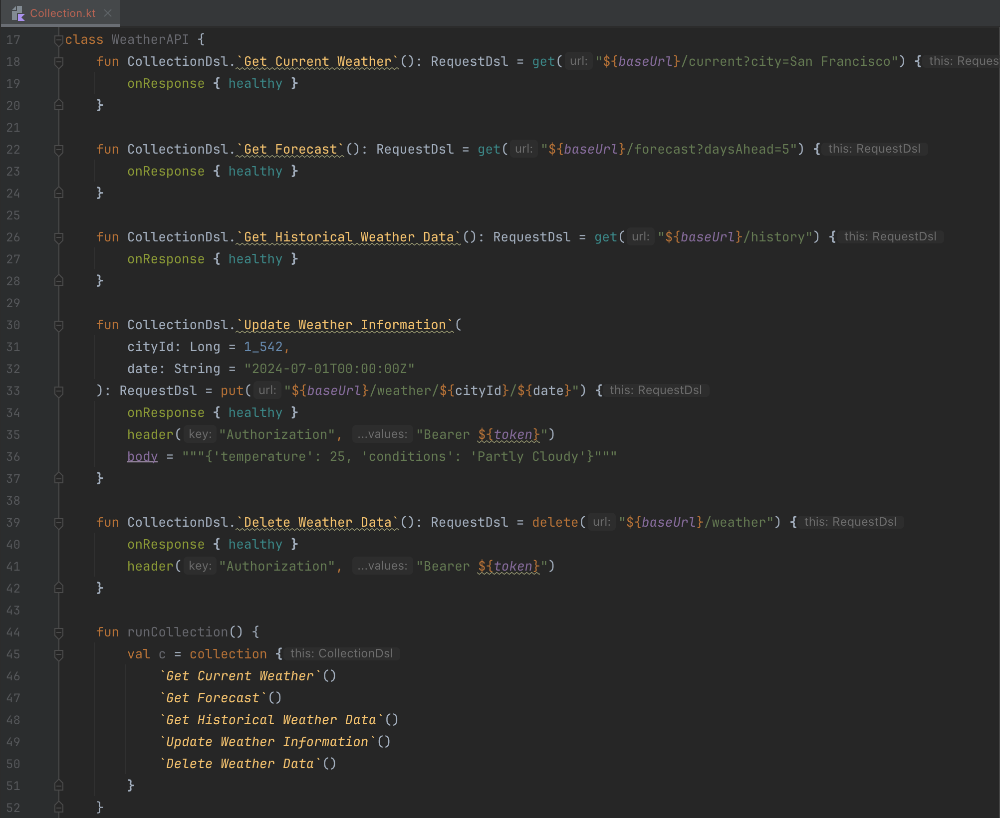

Kontr ([pronounced as Contour](https://dictionary.cambridge.org/pronunciation/english/contour)) is an opensource project to leverage the power of Kotlin DSL to make a simple and expressive api to create http requests.

Disclaimer: you shouldn't use Kontr for performance testing, use https://github.com/gatling instead.

## Important warning
Current version is 1.0.0 and although is fairly usable please consider it **EXPERIMENTAL** with DSL interfaces subjected to changes.

## Dependencies
#### Maven
```xml
<dependency>
  <groupId>org.kontr</groupId>
  <artifactId>kontr-dsl</artifactId>
  <version>1.0.0</version>
</dependency>
```
#### Gradle
```kts
implementation("org.kontr:kontr-dsl:1.0.0")
```
#### Central
https://repo1.maven.org/maven2/org/kontr/kontr-dsl/

## Requirements
The recommended versions are the latest ones available:
- Java 21 or higher
- Kotlin 1.9.22 or higher

#### Old versions support
No support to other versions is provided, although it should be possible to downgrade without much effort.
#### Minimalistic standalone approach
We try to keep the external dependencies to a minimum (`kotlin-stdlib` and `slf4j-api`) but we still recommend to have a new project for the kontr files.
#### Creating a new project
The project [kontr-examples](/kontr-examples) should be a good starting point for a new project and includes `assertj-core` and `json-unit` for convenient assertion writing.

## DSL examples
This is the simplest usage example:
```kotlin
package org.company.example

import org.kontr.dsl.collection

fun main() {
    collection {
        get("https://raw.githubusercontent.com/domgom/kontr/main/README.md") { onResponse { ok } }
    }
}
```
And we can make more expressive function names instead of using the http operations directly.

```kotlin
package org.company.example

import org.assertj.core.api.AssertionsForClassTypes.assertThat
import org.kontr.dsl.CollectionDsl
import org.kontr.dsl.collection

fun main() {
    collection {
        checkReadme()
        verifyLicense("Apache License")
    }
}

private fun CollectionDsl.checkReadme() {
    get("https://raw.githubusercontent.com/domgom/kontr/main/README.md") {
        headers {
            Accept("text/html")
        }
        onResponse { healthy }
        onResponse { assertThat(body).startsWith("# Kontr\n") }
    }
}

private fun CollectionDsl.verifyLicense(licenseName : String) {
    get("https://raw.githubusercontent.com/domgom/kontr/main/LICENSE") {
        headers {
            Accept("text/html")
        }
        onResponse {
            healthy
            assertThat(body.lines().first()).contains()
        }
    }
}
```

## Generation Examples
We can also generate those functions from postman collections, so we can focus on building testing workflows instead of crafting the requests individually.
```cmd
// on project root
mvn jar:jar && java -jar kontr-cli/target/kontr-cli-1.0.0-jar-with-dependencies.jar gp "kontr-generator-postman/src/test/resources/weather.api.postman_collection.json" "kontr-cli/target/generated-sources/postman" "org.example.generated" "Collection"
```

We have now https://kontr.onrender.com/ where you can generate online your Kontr DSL files uploading the Postman collections! :rocket:

Gives us a good baseline  to work with:
```kotlin
package org.example.generated

import kotlin.String
import net.javacrumbs.jsonunit.assertj.assertThatJson
import org.assertj.core.api.Assertions.assertThat
import org.example.generated.Env.baseUrl
import org.example.generated.Env.email
import org.example.generated.Env.password
import org.kontr.dsl.CollectionDsl
import org.kontr.dsl.RequestDsl
import org.kontr.dsl.collection

public data object Env {
    public val baseUrl: String = ""

    public val email: String = ""

    public val password: String = ""
}

public object Auth {

    public fun CollectionDsl.login( email: String, password: String): RequestDsl = post("${baseUrl}/api/login"){
        header("Content-Type", "application/json")
        body = """{"email":"${email}","password":"${password}"}"""
    }

    public fun CollectionDsl.`create user`(): RequestDsl = post("${baseUrl}/api/user"){
        header("Content-Type", "application/json")
        header("Accept", "*/*")
        body = """
    |{    
    |    {
    |         "email": "test@gmail.com",
    |         "password": "Be6hoptsjOgioHBs874aCpdamZP1ZQ",  
    |    }
    |}
    """.trimMargin()
    }

    public fun runCollection1() {
        val c = collection{
            login()
            `create user`()
        }
    }
}
```
If the amount of redundant `public` modifiers bothers you, you can use IntelliJ's `Code/Code cleanup..` to remove them.

## IDE support
We recommend Intellij as the IDE for Kontr (and really any Kotlin project). We get nice colouring for the DSL syntax:




## Architecture
Kontr has a modular architecture so new extensions like other http clients or openapi generator can be included in the future.


## Known restrictions
- Object serialisation/deserialisation is available as convenience functions `RequestDsl.toJson()`/`ResponseDsl.fromJson<T>()` **if you include kotlinx serialisation dependency**.
- Doesn't work with proxies.
- Open api format is not yet integrated, for the time being you can directly import your openapi collection to Postman and export the Postman collection.

## Future updates
Roadmap: work in progress
